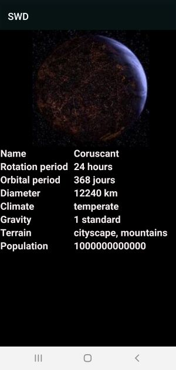

# Star Wars Data

# Présentation

SWD est une application qui permet d'avoir des informations concernant la saga Star Wars. Pour ce faire, on fait appel à l'API "SWAPI",

# Fonctionnalités

* Ecran avec une liste de planètes de la saga
* Ecran avec des informations par rapport à la planète sélectionnée.
* Appel WebService à une API Rest (https://swapi.dev/).
* Stockage de données en cache ( Stockages des données des planètes ) 

# Screenshots
   
    

# Perspectives d'améliorations 

* Ajout de nouvelles planètes dans la base de donnée
* Ajout de données concernant les personnages, les vaisseaux, les véhicules de la saga
* Amélioration de l'interface graphique
